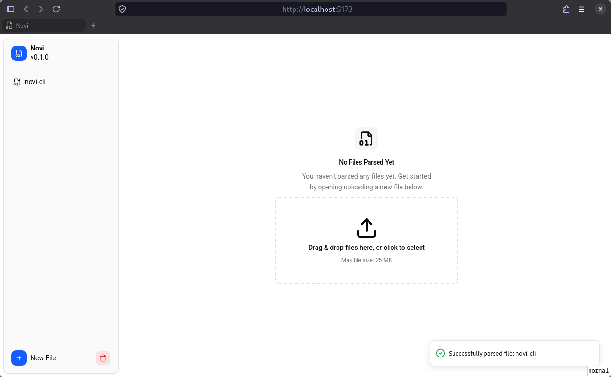
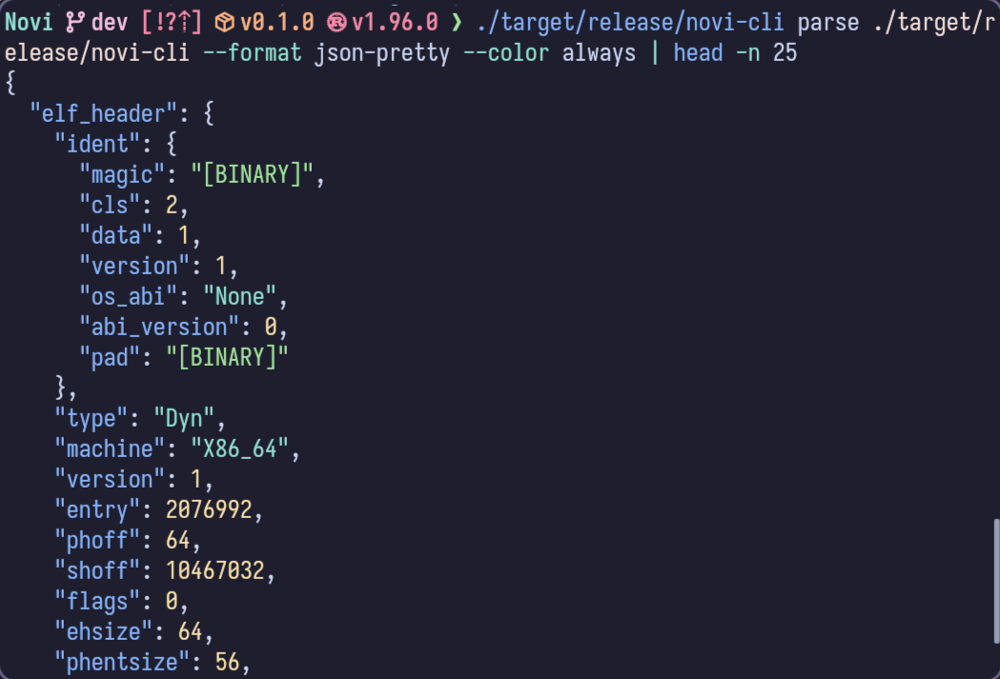
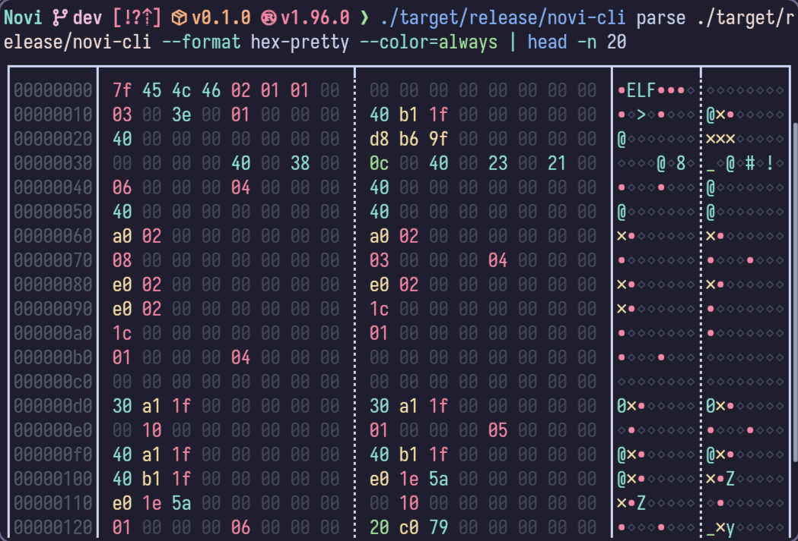

Novi is a structured data inspector and validation system. A core library built
in Rust provides a unified interface for parsing many different data types into
a unified structured format. Included with the core library is a validation
system, allowing for user provided Lua scripts (or builtin ones) which are given
the structured data and can perform arbitrary validations and tests on the data,
producing a validation report highlighting any issues with the data. Several
client applications are also included such as a CLI, Web, and Desktop interface,
which all provide interactive interfaces for exploring the parsed structured
data, and the validation reports.

## Core Parsing

The core parsing library is the core of Novi, and being a library it can be
easily integrated into other applications or paired with other clients. Input
data is first transformed, using a chain of transformers, which allows for
handling compressed / encoded content seamlessly. The library provides a
handler structure for decoding data (the `Decoder`), which provides a robust
and flexible interface allowing for the decoding of complex data types, and the
decoder encapsulates all of the complex logic for converting data types and
storing data into the structured tree. The transformed data is passed to the
data format specific parser, which leverages the decoder to read the raw data
into a structured tree, while recording all of the metadata about each field
that was read.

The core parsing is intended to be _extremely_ forgiving and robust. There
should be very few cases that cause a parser to fail and they are more intended
for marshaling the raw data into the defined structure. The checking if it is
valid data (e.g. has reasonable values, or the right magic numbers, etc.) is left
up to the validators. This allows for greater flexibility and improved support
for parsing malformed or corrupted data.

## Validation

An addition to the core parsing is the validation. Using an embedded Lua runtime,
the Novi library can support validating the parsed structured tree. Each
supported data format includes builtin validation, but users are also able to
define or override with their own validations, by simple writing some simple
Lua scripts. The validation generates a report with different messages which
reference locations in the structured tree, making it easy through the clients
to annotate the corresponding tree nodes with the validation warnings or errors.

## Clients

The client applications are all designed to be agnostic to the data format being
parsed. The core library and validation handles all of the particularities of
each given format, and by the time the client interacts with the data it is a
generic structured tree and validation report. This make sit very easy to add
support for new formats, since nothing needs to change in any of the clients to
support it.

### Web

The web client compiles the rust library into web assembly to be able to run all
of the parsing and validation client side in the web browser directly. And uses
react and typescript for the interface. It provides a clear interface for
loading new files, and viewing the structured tree of the parsed data.

The frontend interface is written using typescript and react, and using
[shadcn/ui](https://ui.shadcn.com/) for the frontend theming. Extending the
philosophy of the core library, the interface aims to be robust and resilient
to any potential issues. The web interface is the main interface new users are
expected to use, so it is careful to include clear descriptions and follow
standard design patterns so that new users can quickly and effectively onboard to
using the tooling with a minimal learning curve for getting started.

### Command Line Interface

The Command Line Interface (CLI) acts as a power user client. It provides all of
the features of the other clients (without the interactivity that other clients
can provide), while aiming to be a slim wrapper around the library. It includes
some additional power user focused features that are not available in the web
client such as dynamically streaming content from files rather than needing to
read it all into memory. This allows the CLI to parse significantly larger files
than the web interface can currently handle.

Because the CLI client is a thin wrapper around the core library, it is a useful
reference when implementing other clients, for a starting point to see how to
integrate and leverage the library features to the fullest. The CLI client also
provides useful hooks for more programmatic interaction. It supports outputting
into machine readable formats (such as JSON or XML) which can then have further
post processing applied as needed by the end user.

The CLI includes several builtin formatters for rendering the raw data as well
as the parsed data tree, making it a useful tool for any of the users needs for
inspecting their data, even if parsing failed it can still provide clear hex
view of the data for manual inspection. And being directly in the command line
it can be used on hosts that may not have a graphical interface for the desktop
or web clients.

