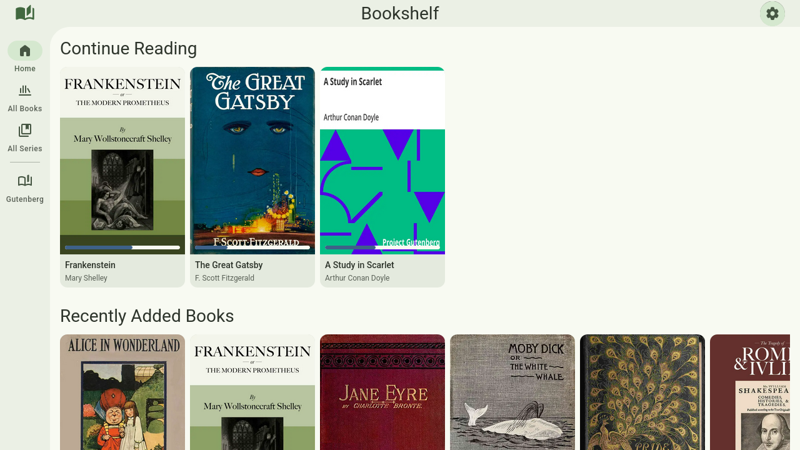
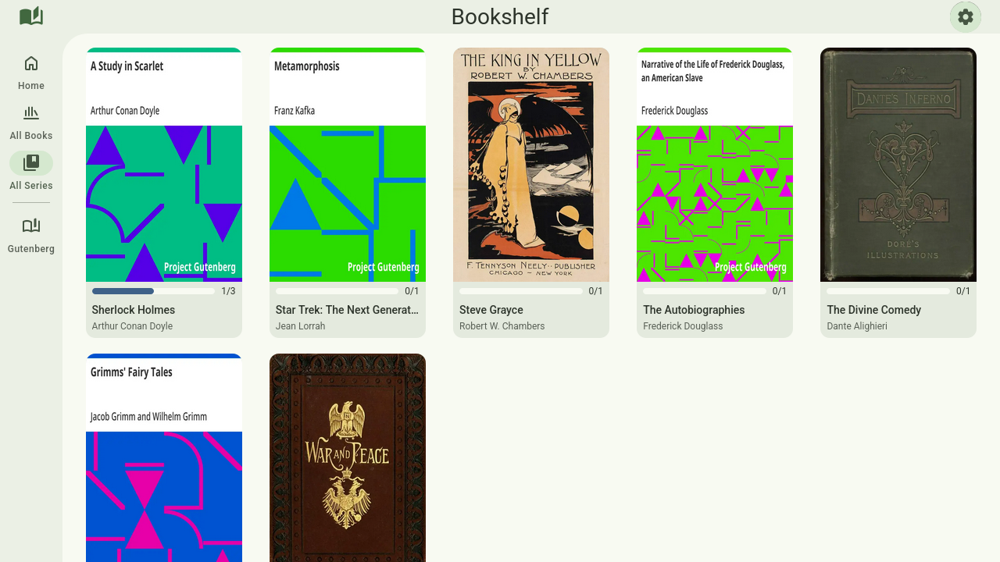
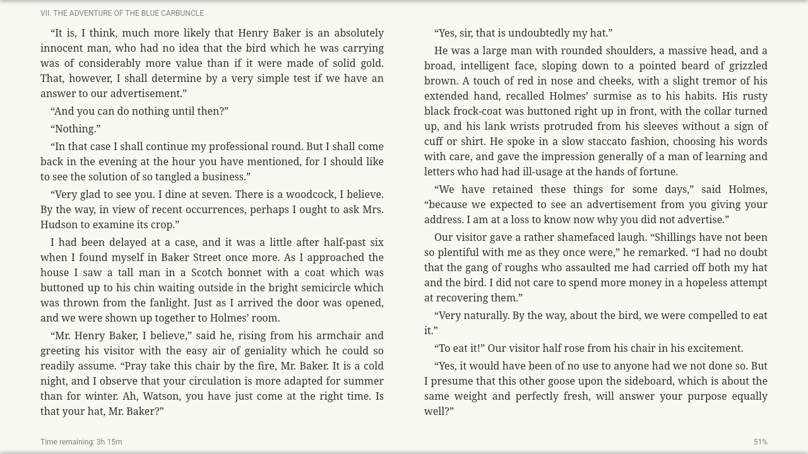
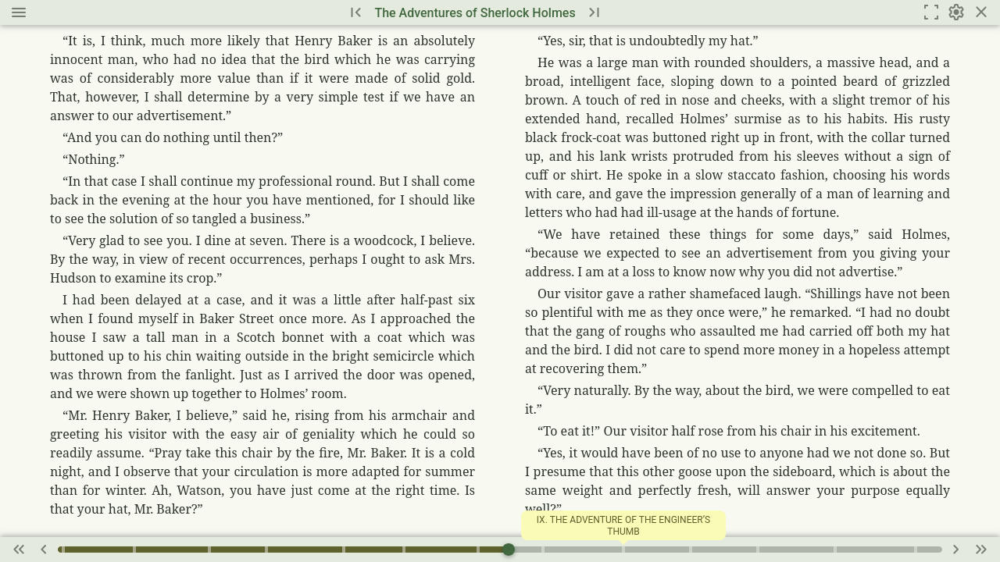

Bookshelf is a focused self hosted e-book manager. It is primarily focused on the
server side and providing a well organized e-book database, and exposing those
through an Open Publication Distribution System (OPDS) API for third party
clients to consume (such as e-readers like Kindle, or mobile or desktop
applications).

The server is written in Go with a strictly defined OpenAPI schema making it
easy for third party clients to integrate with the server backend. Bookshelf
handles detecting new or modified files through file system watching, and
automatically reads the metadata from the EPUB, MOBI, or PDF file (or if present
a sidecar metadata file). Using that metadata it builds a database of all the
books and series. 

Bookshelf also includes support for third party metadata providers to supplement
the embedded metadata, filling in any missing information such as series, or
cover images. Currently it supports [Hardcover](https://hardcover.app/),
[Goodreads](https://www.goodreads.com/), and [RanobeDB](https://ranobedb.org/).
With a scoring mechanism to score the quality of metadata match with the embedded
metadata to ensure that the best metadata is used for each book.

The server also tracks user reading progress, which can be synchronized from all
clients to the server so that reading progress is automatically shared across
all devices and platforms.

## Web Reader

In addition to the main OPDS API, Bookshelf also includes a built in web reader.
This allows users to read their books directly in the browser without needing to
install any additional applications. The web interface is designed following the
[Google Material Design](https://m3.material.io/) system with dynamic theming
that applies to both the library browser as well as the reader.

### Library Browser

The library browser includes pages for a home dashboard showing in progress
books to quickly pick up where you last finished, as well as recently added
books and book series to the server. Each in progress or completed book also
includes a progress indicator making it easy to see which books have been
finished or where you are in the book. 

It also includes a page for browsing all books or all books in a specific
library. These pages use paginated queries and a virtualised renderer to improve
performance for large libraries by only rendering the books within the viewport,
while prefetching data so that it is a smooth scrolling experience with minimal
need for buffering.

The series view shows a list of all book series in the library, which again
includes a progress indicator this time for the overall series, indicating how
many books the user has read and how many are in the series as a whole. And
clicking on the series will open the reader for the next book in the series for
the user to read, making it very easy to quickly jump back into a series that
you have started.

### Reader

Clicking on any book or series in the library will open the reader for that
book, continuing from the last reading position for that user. The reader
supports all of file types supported by the server (EPUB, MOBI, PDF). The
handling of the rendering of the e-books is provided by
[foliate-js](https://github.com/johnfactotum/foliate-js).

The reader is aimed to be a clean and focused reading experience without getting
in the users way, while still providing all of the necessary features for a good
reading experience. The base layout includes a chapter indicator and a time
remaining for the book. It includes support for advanced formatting options such
as customizing the reader theme (separate from the rest of the web interface),
adjusting the font family, size, and line spacing. As well as customization of
the layout like the number of columns, the gap between columns, the
justification of the text, etc.

These settings are all saved client side to remember the users preferences, and
allow for detailed customization to allow users to tune the reading experience
to be best suited for them.

The reader also includes a pop-up header and footer which include quick actions
for navigating the series (jumping to the previous or next book in the series),
as well as a progress bar for the current book, allowing to jump to specific
chapters or sections of the book.
