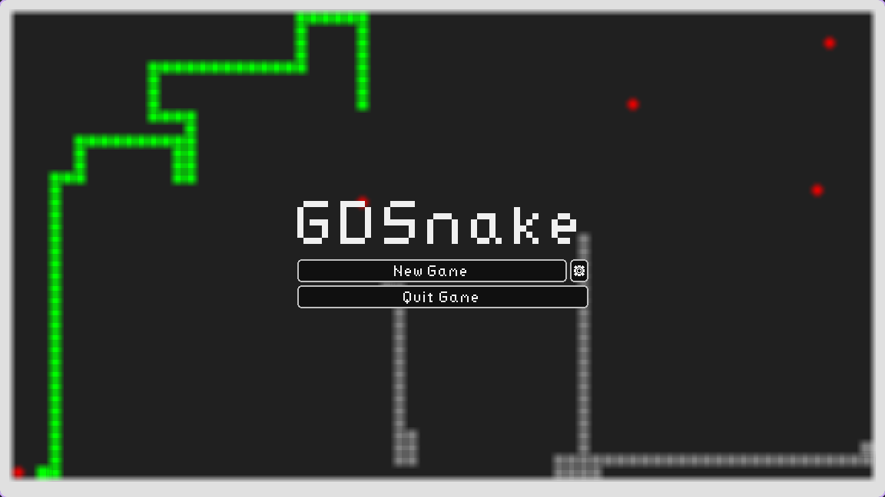
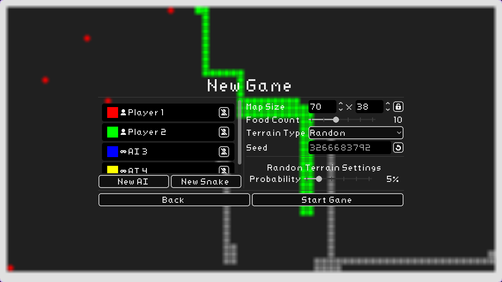

GD Snake is a fully featured implementation of the classic Snake game, built
using the [Godot](https://godotengine.org/) game engine. The aim of the project
was primarily a learning experience for game development and how to use the
Godot game engine. So it implements all features of a full sized game, just
applied to the smaller scope of Snake.

The main menu, includes a real-time game of snake running in the background
using AI snakes, to provide visual interest while the user is in the menus.
Along with a standard settings allowing for the adjusting audio levels (which is
persisted) and dynamic rebinding controls. The game includes a palettes swap
shader allowing for multiple themes and styles to be easily applied to the full
game, and includes a selection a builtin color palettes the user can pick from.

The game itself supports arbitrary number of AI opponents and up to four
players. The initial spawn points for the snakes are guaranteed to be spaced
out in the selected map so that there isn't immediate contention when the game
starts. The map size can also be arbitrary large or small, when the map is too
large to fit on a single screen then a camera follows the snake, the zoom of
which can be controlled in the settings. When multiple players are in the game,
then it supports split screen so each player has their own camera. The map can
also include optional obstacles, which place walls throughout the map which
breaks up the open space and requires more strategy to work around and plan
ahead to avoid.



AI is implemented using a simplified A* pathfinding algorithm, which allows the
AI snakes to navigate the map and avoid obstacles while trying to get to the
food. A* alone tends to be _too_ good at navigating the map, so to make the AI
more human like and less perfect, a random chance of making a suboptimal move
is added to the AI. This allows for more interesting games where the AI can
make mistakes and be beaten by the player, while still being good enough to
provide a challenge.

Finally the game also includes both background music tracks, and sound effects
to provide more user feedback when actions occurs.

Although simple, this implementation of snake covers user input (and
accessibility through rebinding controls), graphics, AI, menus, persistent/save
data, and music and sound effects. And through the development of this game I
have gained a better understanding of these different pieces and how to fit them
together into a larger project.

