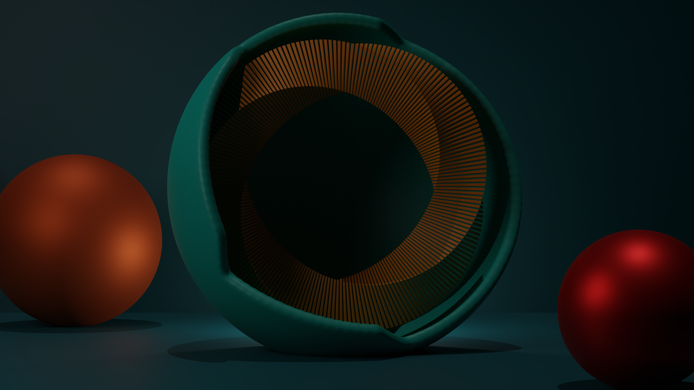
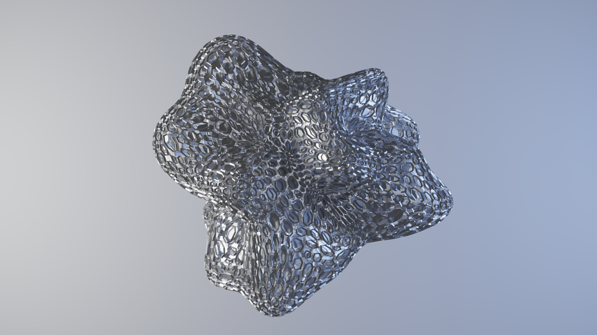
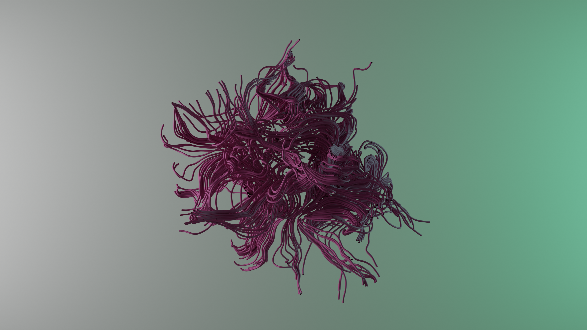

I tasked myself to make a new render using blender once a week. I decided to to
this to help improve my skills with blender, and to produce some interesting
images that.

The eventual goal of this project is to learn how to use Blender more fluently,
so that I am able to integrate the [Specula](../5djw) with Blender
more effectively. Since Specula is not intended to be a modeling software, I
intend to use blender to do the modeling, and then load the scenes into the
Specula renderer. So the first step of that process is to learn how to use
Blender effectively.

