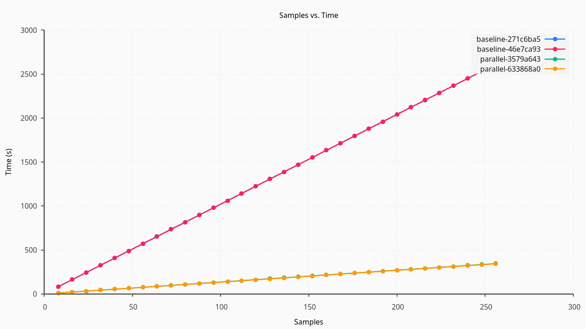
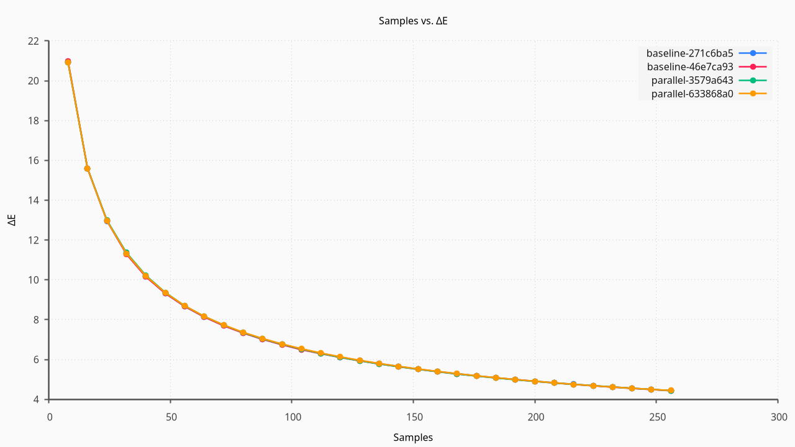
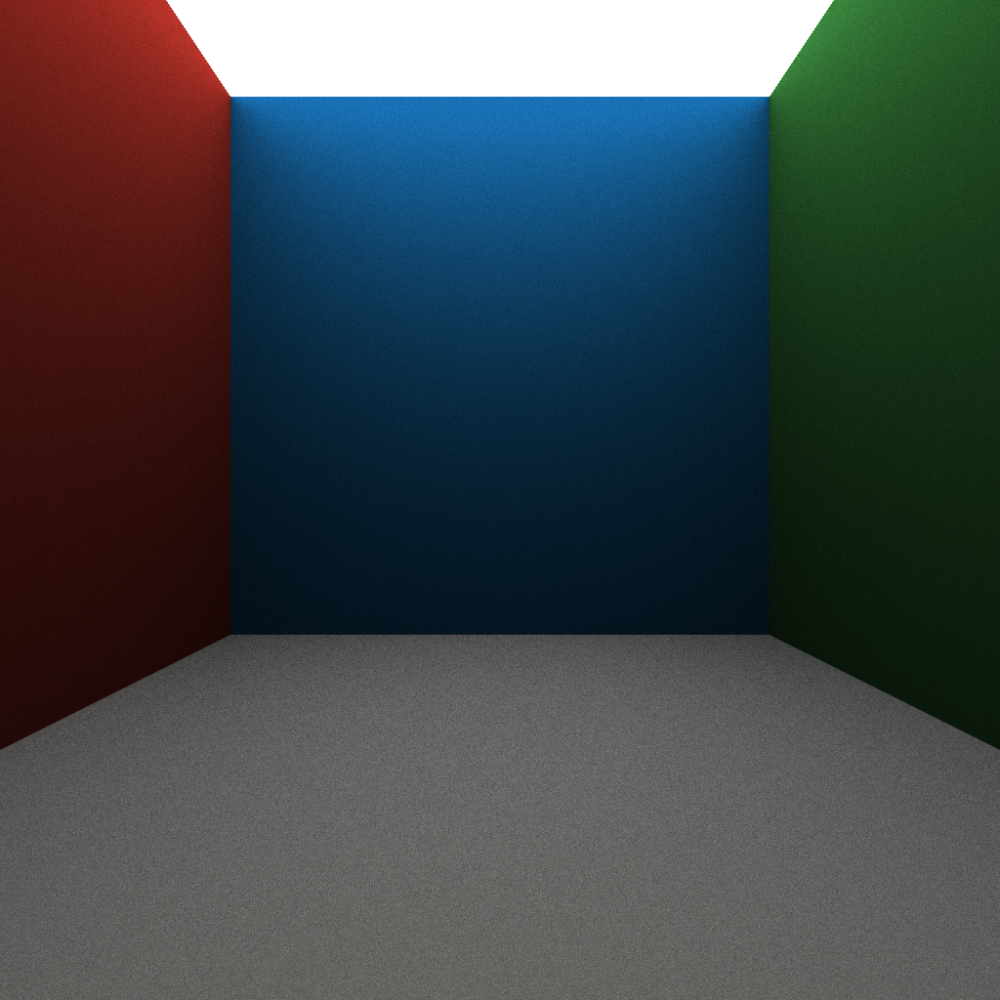
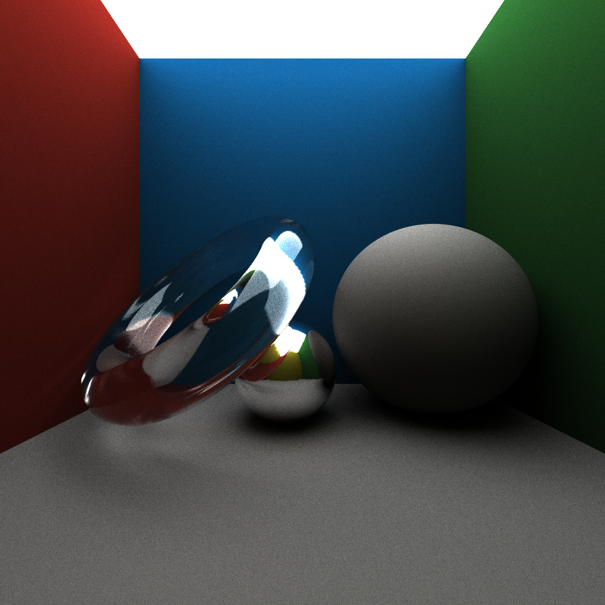
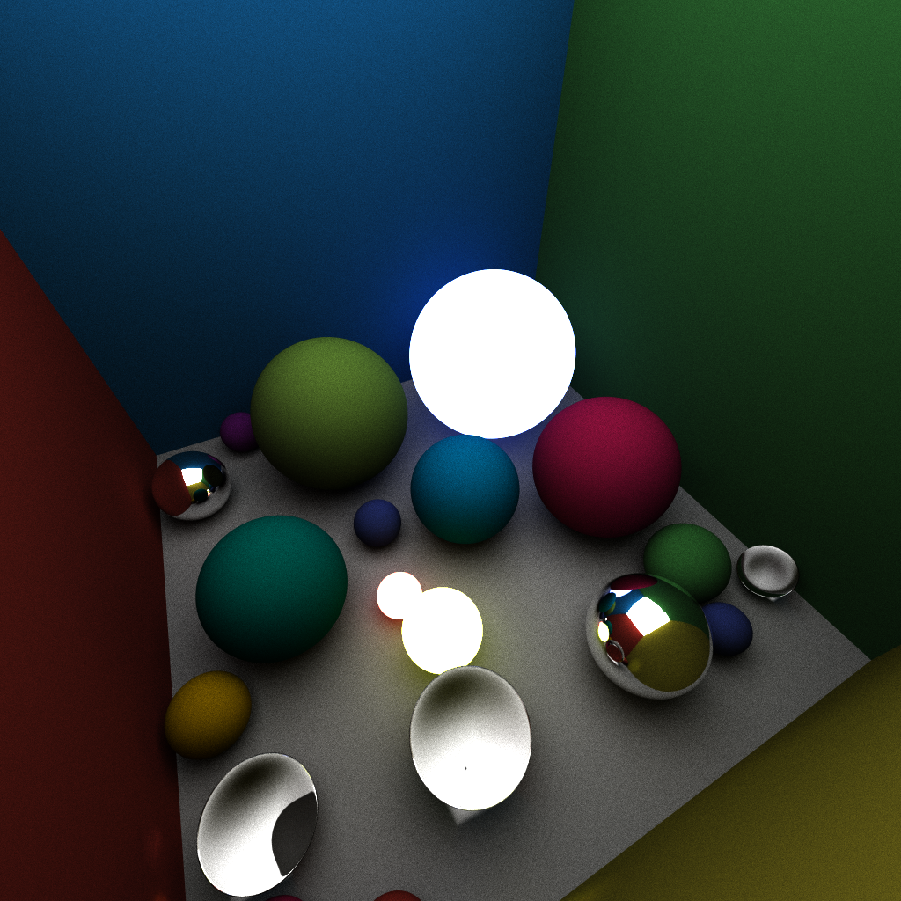
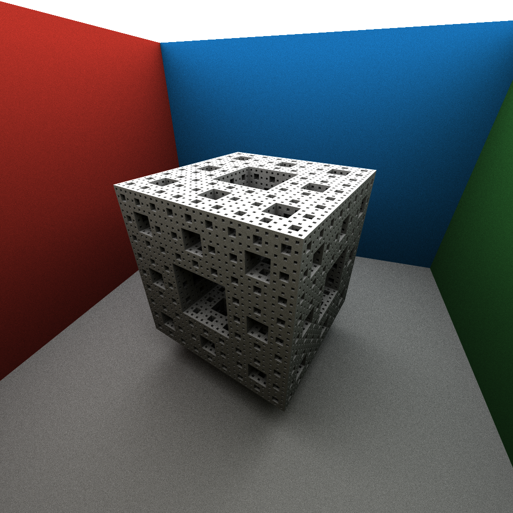
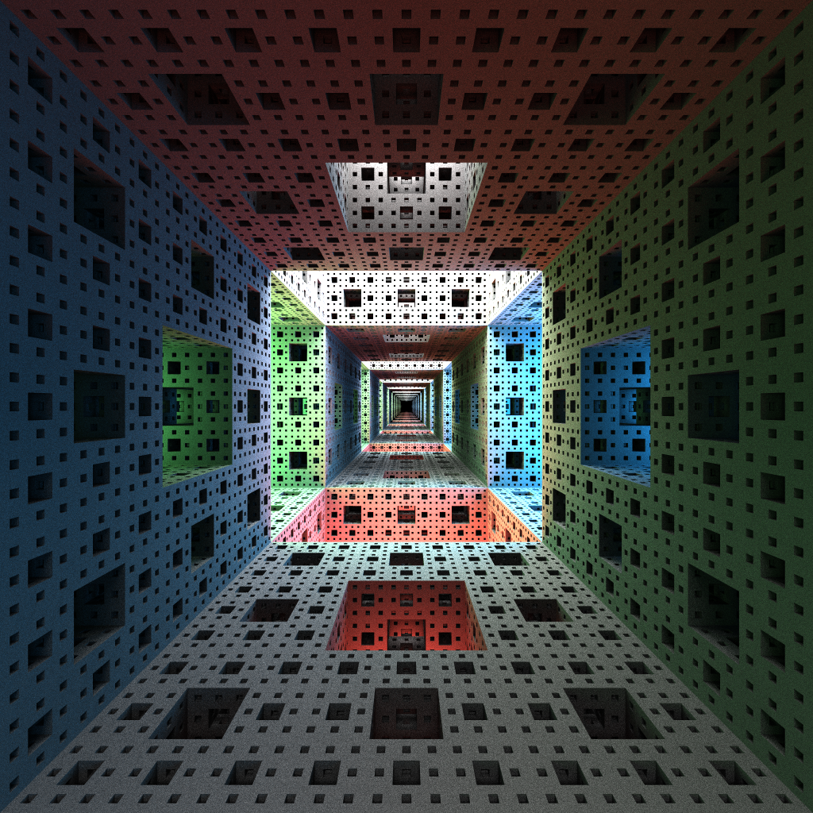

Tiny Ray March v2 is a reworking of the previous version of [TRM v1](../ztb4),
with an emphasis on data collection to analytically quantify the quality and
performance improvements of different features. It is designed as a simple and
lightweight ray marcher for educational purposes and as a test platform for
understanding ray marching and the performance improvements that come from
various features.

TRM is written as a C++ library, and the scene definition is a C++ structure
which can be either statically defined in a runtime, or dynamically created by a
runtime. It implements a minimal set of features initially, and only supports a
small set of material types (Emissive, Diffuse, Specular, Refractive, and
Fresnel). And as more features are implemented, the performance and quality
improvements of each feature are tested with the included example scenes, and
the results are recorded in a spreadsheet for analysis.

## Statistical Analysis

There are two main aspects that are being analyzed as part of this project. 
The first being the performance, the time it takes to render each scene with
varying number of samples. More complex scenes will take longer to render
per-sample and more samples tends to linearly increase the time to render a
scene.

The second aspect is the convergence towards the global truth. Photorealistic
rendering through ray tracing or ray marching attempts to simulate the path of
photons through a scene. However, it is not possible to simulate all the
photons, so through clever statistical sampling we attempt to capture the scene
while only simulating a small fraction of the light. This statistical sampling
means that with more samples we expect to eventually converge towards "reality"
by sampling more and more rays of light. So the second measurement is how
quickly we converge towards the accurate output, and how effectively are we
sampling the most important rays of light. 

This measurement of convergence is harder to quantify, we approximate it by
rendering a final extremely high-quality image using a much higher number of
samples ($\sim1024$). Then re-rendering the same scene using a different seed
and saving snapshots at fixed intervals. Then for each snapshot we compute the
average $\Delta E$ difference between the snapshot and the high-quality "final"
image. That $\Delta E$ value is the measure of perceptual difference between the
two images, allowing for small differences that are not noticeable by humans. And
my comparing the rate of decrease for the $\Delta E$ we get an approximation for
the rate at which the image is converging to the ground truth.

> [!NOTE]
> For a single color a $\Delta E \leq 2$ is considered to be an imperceptible
> difference. Since this data is the average for each individual pixel this
> isn't as accurate but it is a continent baseline to understand when viewing
> the statistics.

## Sample Scenes

A basic empty room, with an emmisive ceiling, a diffuse floor and walls. There
are no objects in the scene, and no reflections or refractions. This is the most
basic scene, and serves as a baseline for testing the best case performance.

---

A basic scene extending the empty room. Now including three objects. A diffuse
white sphere, a reflective metallic sphere, and a glass torus. This scene is
still relatively simple, but include the main material types for testing the
BSDFs and the ray marching features.

---

Extending the empty room, this scene includes 20 randomized spheres. 11 spheres
are diffuse, 3 are reflective, 3 are transmissive, and 3 are emissive. This
scene includes the most objects and is intended for measuring improvements
around many objects such as Bounding Volume Hierarchies (BVHs) with many
reflections and refraction bounces.

--- 

The Menger sponge is a classic fractal object, and is a good test for ray
marching specific features which cannot be easily implemented in a ray tracer.
The recursive nature of the object means that it has a lot of small details, and
requires many ray bounces to accurately capture the scene.

---

The infinite Menger sponge, leverages the ease of replicating objects in ray
marching to create an infinite scene. This provides testing for ray marching
specific features, as well as extending the Menger Sponge scene as a torture
test with many details requiring many ray bounces to capture the scene.
