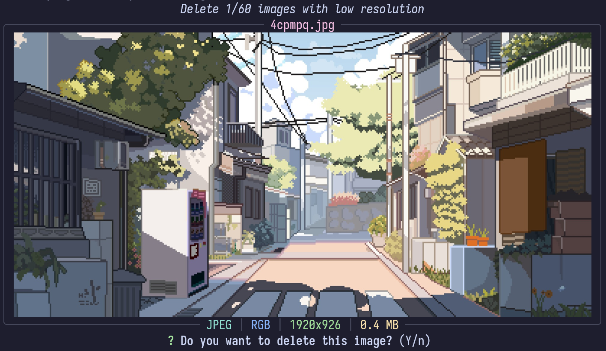
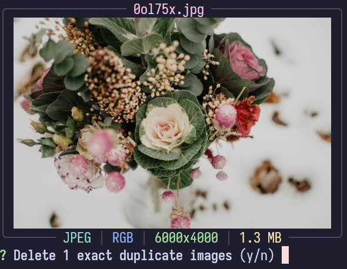
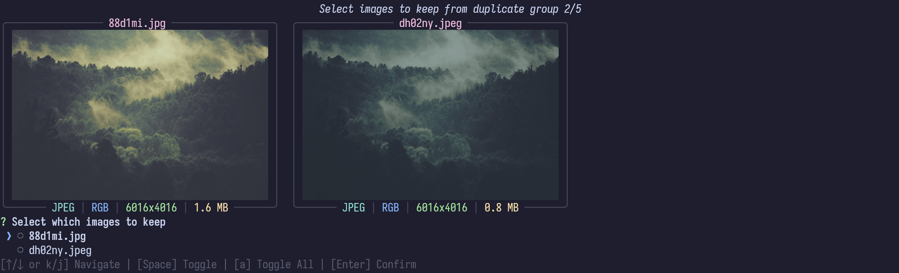
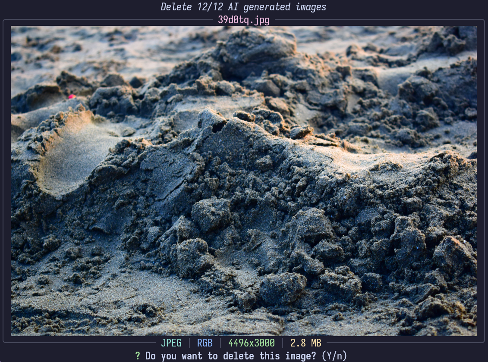
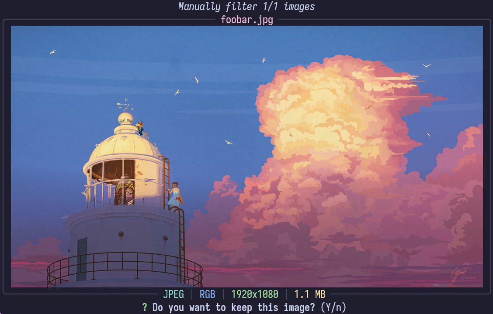

`wall.py` is a single python script designed automate the management of a
wallpaper collection. As a collection of wallpapers grow, properly managing the
images becomes more and more difficult (my current collection is ~900 images),
and this utility was designed to automate and make it easier to manage the image
collection.

`wall.py` is built as a CLI application, leverging
[Rich](https://rich.readthedocs.io/en/stable/introduction.html), [Prompt
Toolkit](https://python-prompt-toolkit.readthedocs.io/en/3.0.52/), and the
[Terminal graphics protocol](https://sw.kovidgoyal.net/kitty/graphics-protocol/)
to cleanly display thumbnails of images and prompt the user for final decisions.
This makes it a fully complete workflow without requiring the user to open up
any other tools and creating a coheasive experience.

By default it only operates on the new images in the directory, or images that
have been modified, allowing it to skip much of the work and filtering of images
already in the collection.

## Processing Pipeline

The logic is built into a processing pipeline of different filters to apply to
the images, allowing for flexibility on which filters to apply and the order
they should be applied.

Each filter is responsible for filtering out undesierable images from the
wallpaper collection before passing the remanining list of images to the next
stage of the pipeline.

### Resolution Filter

The first and simplest filter is a resolution filter. It identifies any images
with a resolution smaller than a set target (defaults to 1920x1080). With the
growing market of high resulotion 4k / 8k monitors images with a resolution
smaller than 1080p are noticably low resolution. So this filter simply
identifies those images and prompts the user if they should be removed.

### Duplicate Filter

The deduplication filter has two pases, first is the exact duplicate filter, and
a second pass is a percetual similarity deduplication filter.

#### Exact Duplciate Filter

The exact duplicate filter computes the SHA1 hash of each image and looks for
any exact duplicates which one could be safely removed without loosing any data.

#### Perceptual Similarity Filter

The perceptural filter uses the [pHash](https://phash.org/) algorithm for
perceptural image hashing, and compares all image hashes with all other images
to identify similar images. By using perceptual hashes it is possible to handle
slight changes in color, or different resolution and formats that are missed by
the exact duplicate filter.

However, this can identify false matches so it interactivly prompts the user to
select which of the images to keep, allowing for the user to have the final
decision between the two.

### AI Generated Filter

With the advancement of AI generated images, they have become significantly more
prominent online, and increasinly difficult to differentiate an AI generated
image or a human's digital art. For my personal wallpaper collection I want to
celebrate human creativity and would prefer to exclude AI generated images.

This filter applies multiple AI image classification models to attempt to
identify AI generated images to remove. Using the
[umm-maybe/AI-image-detector](https://huggingface.co/umm-maybe/AI-image-detector)
and [Organika/sdxl-detector](https://huggingface.co/Organika/sdxl-detector)
models are run on all the images not yet filtered out. Any images that are
classified as AI generated with confidence exceeding the set threshold are
prompted to the user for the final decision.

### Manual Selection

The final filter is manual selection. This filter is only enabled when adding
new images to the repository, and it allows for a quick interface to manually
decided which images to actually include. It's most useful when importing large
collections of images to allow the user to select which specific images they
want to import. By being at the end of the pipeline, all images that can be
automatically filtered out will have been done so, leaving less work for the
user to manually approve.

## Renaming

The final step is to rename the files, normalizing the names from all of the
various sources into a consistent naming scheme. The primary naming pattern is a
random ID, most usage of wallpaper images is agnostic of the actual file name
(e.g. using visual selectors or automatic wallpaper selection from images within
a folder). Using a random ID gaurentees uniqueness while keeping the names short
and friendly for all different types of filesystem.

An alternative option is to use an AI image classification model to generate
tags for each image. The five highest confidence tags for the image are joined
into a file name. This gives each image a semi-descriptive file name making it
easier to search for specific images through their file name.
